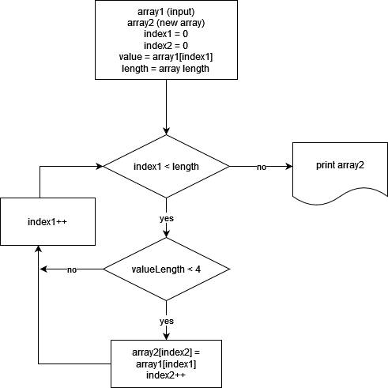

# Задача
## Написать программу, которая из имеющегося массива строк формирует массив строк, длина которых меньше либо равна 3 символа. Первоначальный массив можно ввести с клавиатуры, либо задать на старте выполнения алгоритма. 
~~~~
Общее решение:
Возьмем готовый массив и перенесем нужные строки в новый массив
~~~~

